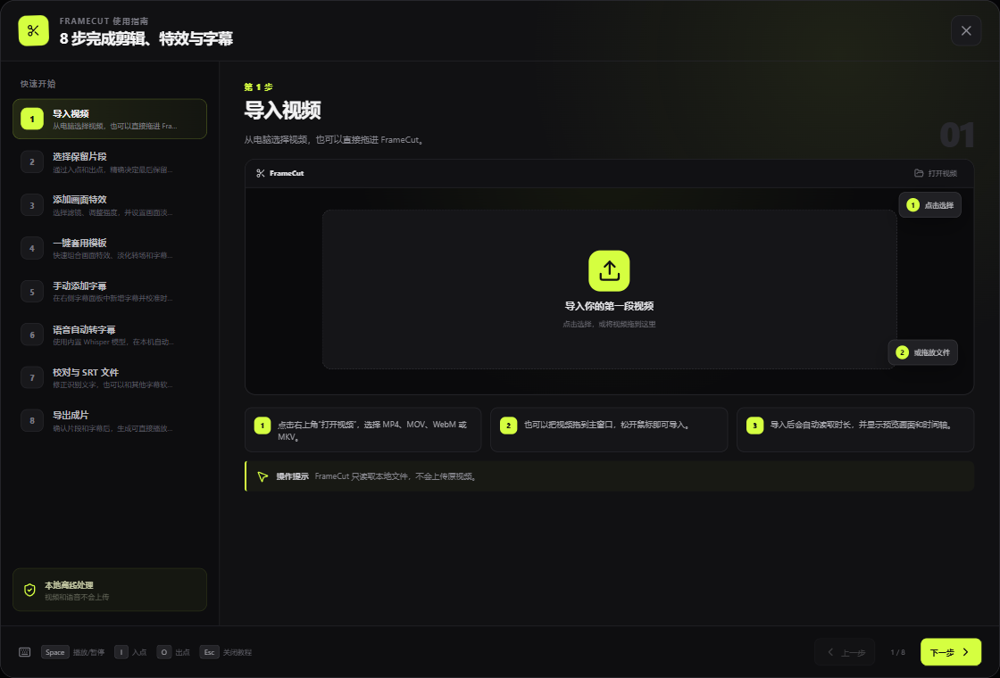
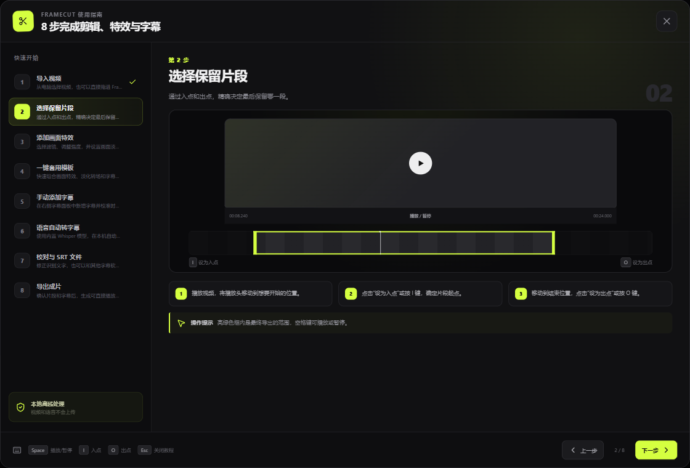
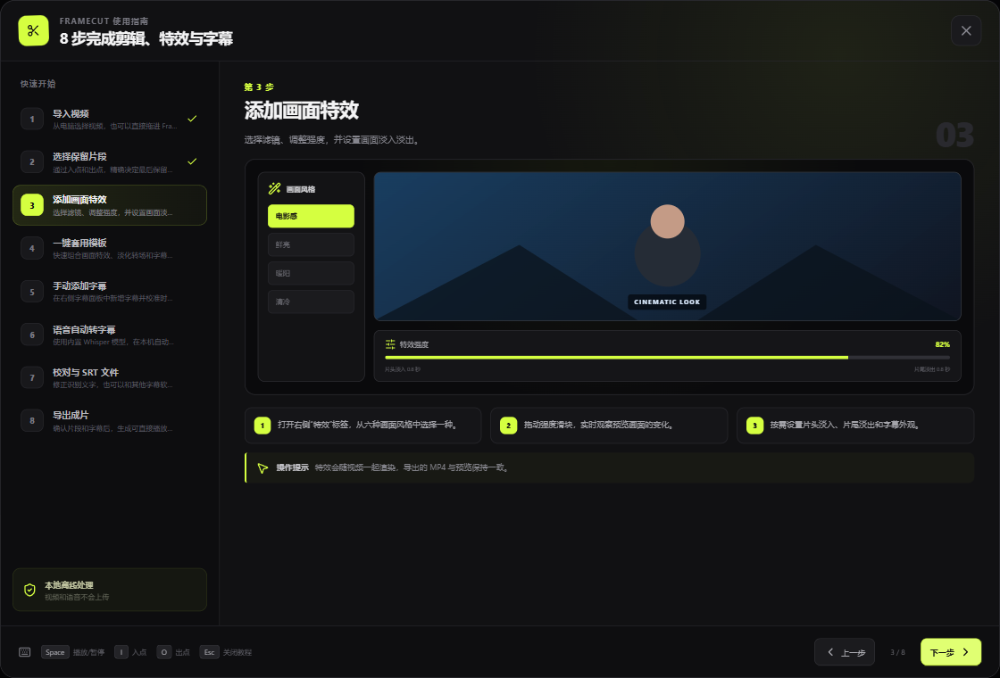
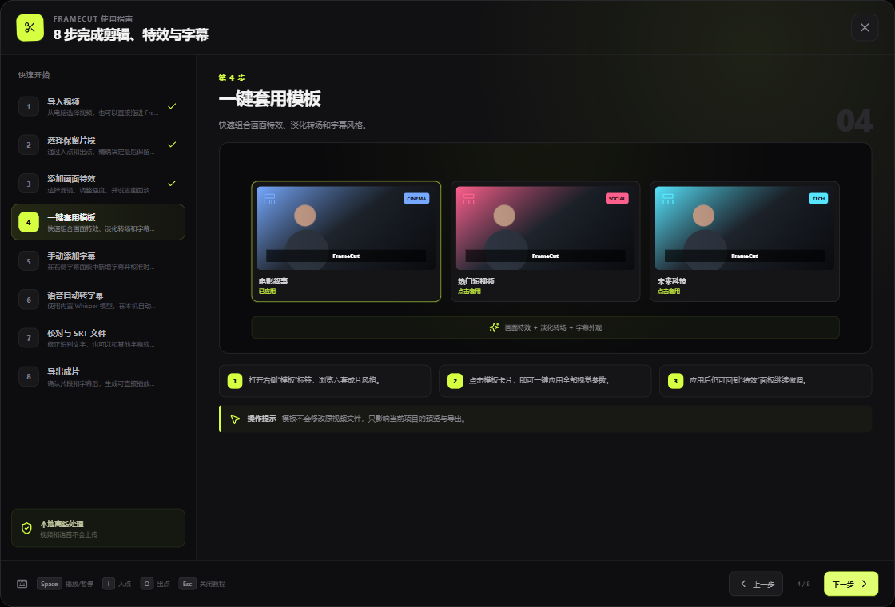
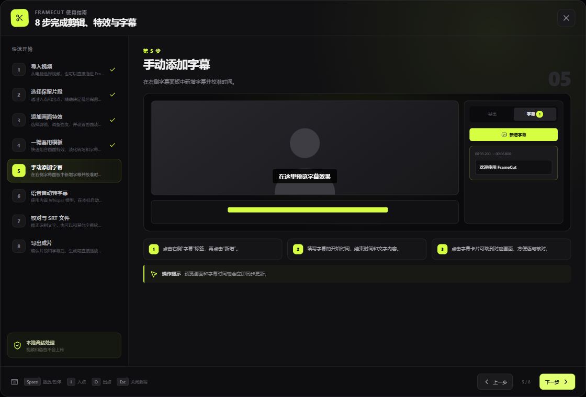
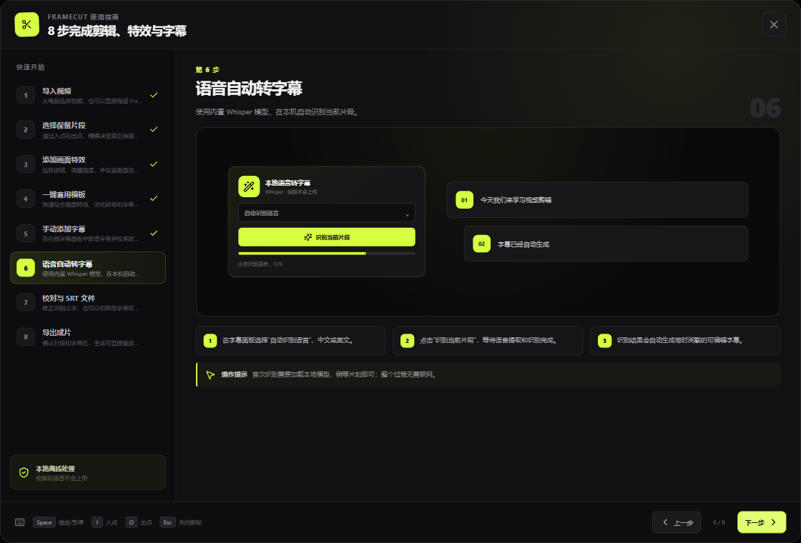
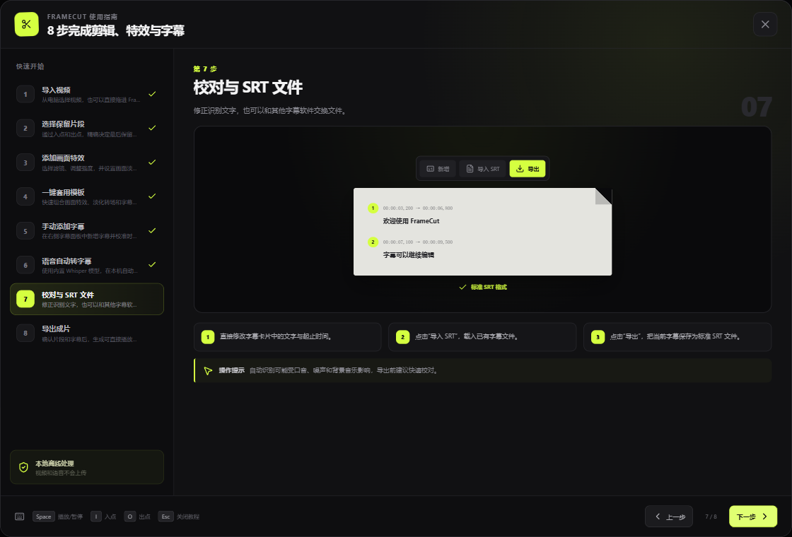
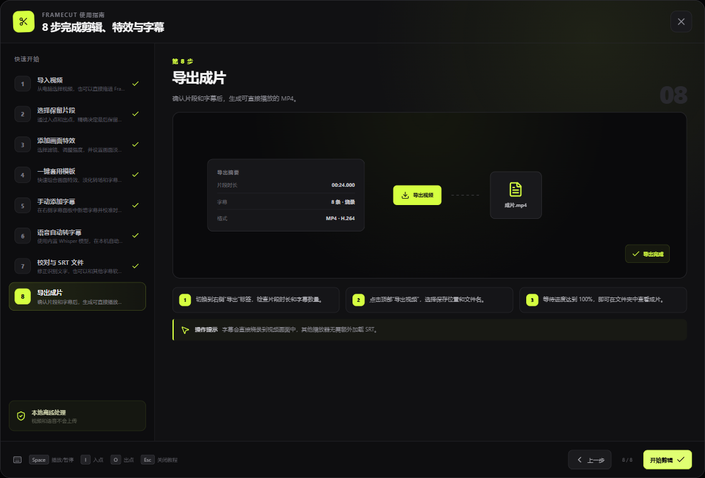

# FrameCut 图文使用教程

这份教程覆盖 FrameCut 0.3.0 Beta 的完整基础流程：导入、裁剪、特效、模板、字幕、语音转字幕、SRT 校对和导出。应用内点击右上角“帮助”，也可以打开同一套八步引导。

> FrameCut 在本机读取视频和运行 Whisper，媒体文件与语音不会主动上传。操作前建议保留原始素材备份。

## 第 1 步：导入视频

点击右上角“打开视频”，选择 MP4、MOV、WebM 或 MKV；也可以直接把视频拖入主窗口。导入后，FrameCut 会读取时长并显示预览画面和时间轴。

## 第 2 步：选择保留片段

播放视频并移动到想要开始的位置，点击“设为入点”或按 `I`；移动到结束位置，点击“设为出点”或按 `O`。亮绿色范围就是最终保留的片段，按空格键可以播放或暂停。

## 第 3 步：添加画面特效

打开右侧“特效”标签，选择电影感、鲜亮、暖阳、清冷、黑白或复古胶片。拖动强度滑块观察预览变化，还可以设置片头淡入和片尾淡出。

## 第 4 步：一键套用模板

打开“模板”标签并点击模板卡片，即可组合应用画面特效、淡化效果和字幕外观。套用后仍可返回“特效”面板继续微调，原视频文件不会被修改。

## 第 5 步：手动添加字幕

进入“字幕”标签并点击“新增”，填写开始时间、结束时间和字幕文字。点击字幕卡片可以跳到对应画面，预览窗口和字幕时间轴会同步更新。

## 第 6 步：语音自动转字幕

在字幕面板选择自动识别、中文或英文，然后点击“识别当前片段”。FrameCut 会在本机提取音频并使用内置 Whisper 模型生成带时间戳的字幕；首次加载模型可能需要稍等片刻。

## 第 7 步：校对与 SRT 文件

逐条修正识别文字和起止时间。点击“导入 SRT”可以载入已有字幕；点击“导出”可以保存标准 SRT 文件。口音、噪声和背景音乐可能影响识别结果，成片前应完成校对。

## 第 8 步：导出成片

切换到“导出”标签，检查片段时长、字幕数量、特效和模板，然后点击顶部“导出视频”并选择保存位置。字幕会直接烧录到 H.264/AAC MP4 画面中，其他播放器无需额外加载 SRT。

## 常用快捷键

| 快捷键 | 功能 |
| --- | --- |
| `Space` | 播放或暂停 |
| `I` | 将当前位置设为入点 |
| `O` | 将当前位置设为出点 |
| `Esc` | 关闭图文教程 |

## 常见问题

- 语音识别刚开始较慢：首次需要加载本地 Whisper 模型，属于正常现象。
- 自动字幕有错字：先选择明确的语言，再校对人名、术语和带噪语音。
- 导出后没有独立字幕文件：默认把字幕烧录到画面；需要独立文件时，先在字幕面板导出 SRT。
- 安装时提示未知发布者：当前 Beta 安装包尚未配置商业代码签名证书。

返回 [项目首页](../README.md)。
